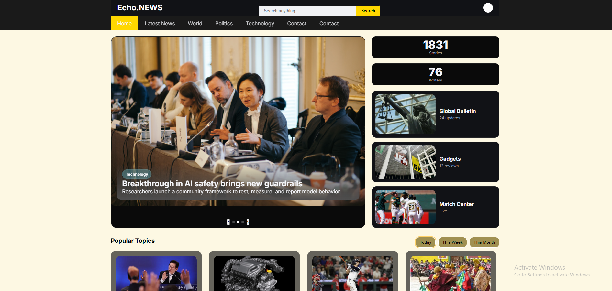
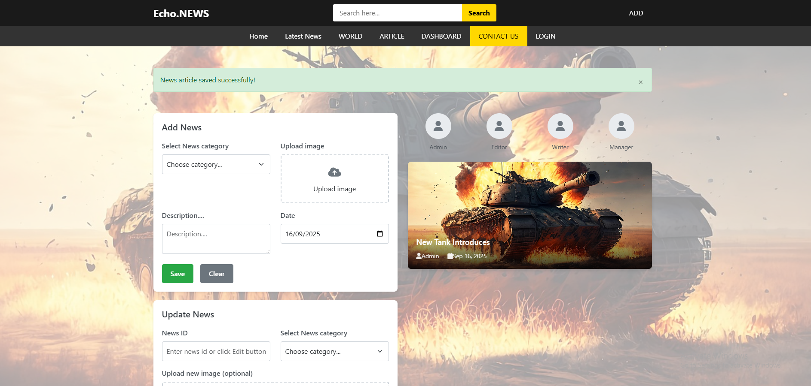

# EchoNews 📰

EchoNews is a simple news website developed as a group project using **HTML, CSS, Bootstrap, JavaScript, and PHP**.  
It allows users to view news and provides an admin panel to manage news articles.

---

## 🚀 How to Run the Project

1. Clone or download this repository into your local server directory (e.g., `htdocs` in XAMPP).
2. Import the database SQL file (`news_db.sql`) into **phpMyAdmin**.
3. Open the `config.php` file and update your MySQL username and password:

   ```php
   <?php
   $host = "localhost";
   $user = "root";        // change if different
   $password = "";        // your MySQL password here
   $database = "news_db"; // database name

   $conn = mysqli_connect($host, $user, $password, $database);

   if (!$conn) {
       die("Connection failed: " . mysqli_connect_error());
   }
   ?>
4. Start your local server (e.g., Apache and MySQL in XAMPP).
5. Open your browser and navigate to:
   ```
   http://localhost/News/News-Site/pages/index.html

## 👥 User Roles

### Users
- View all news articles.

### Admin
- Login to the admin panel.
- Add, update, delete, search, and view news.

## 🛠️ Technologies Used
- Frontend: HTML, CSS, Bootstrap, JavaScript
- Backend: PHP
- Database: MySQL

## ⚙️ Features
- User login & registration  
- Admin login  
- Add, update, delete, and search news  
- Responsive design with Bootstrap

 ##  🛠️ Troubleshooting
Common issues:
- Connection errors: Check database credentials in config.php
- Page not found: Verify your local server path structure
- Permission errors: Ensure uploads/ directory has write permissions
- SQL import errors: Verify MySQL version compatibility

## 📸 Project Screenshots

### 🏠 Home Page


### 📰 Admin Panel


## 📞 Support
For technical issues, contact the development team or refer to the source code comments.
